Palmer Penguins - analiza statystyczna
================
Karolina Kurus, Agnieszka Sarkowicz
2026-05-08

## Omówienie danych

link do zestawu na stronie kaggle:
<https://www.kaggle.com/datasets/larsen0966/penguins>

Dane zostały zebrane i udostępnione przez dr. Kristen Gorman i Palmer
Station, Antarctica LTER (Long Term Ecological research). Dotyczą one
trzech gatunków pingwinów zamieszkujących Archipelag Palmera na
Antarktydzie.

``` r
library(knitr)
library (tidyverse)
data <- read.csv('penguins.csv')
```

``` r
data <- data[,-1]
```

### Opis zmiennych:

- **species** (jakościowa): gatunek osobnika
- **island** (jakościowa): wyspa, na której dokonano pomiaru
- **bill_length_mm** (ilościowa): długość dzioba w milimetrach
- **bill_depth_mm** (ilościowa): grubość dzioba w milimetrach
- **flipped_length_mm** (ilościowa): długość skrzydła/płetwy w
  milimetrach
- **body_mass_g** (ilościowa): masa ciała w gramach
- **sex** (jakościowa): płeć pingwina
- **year** (zmienna czasu): rok w którym dokonano pomiaru

``` r
n_obs <- nrow(data)
n_vars <- ncol(data)
n_missing <- sum(!complete.cases(data))
```

- **Liczba obserwacji (całkowita):** 344
- **Liczba zmiennych:** 8
- **Liczba brakujących obserwacji:** 11

### Statystyki opisowe

#### Zmienne jakościowe

``` r
# Funkcja do szybkiego podsumowania zmiennej z NA
podsumuj_zmienna <- function(data, var_name) {
  data %>%
    group_by(across(all_of(var_name))) %>%
    summarise(Liczebność = n()) %>%
    rename(Kategoria = 1) %>%
    mutate(Kategoria = as.character(Kategoria))
}

# Funkcja do rysowania wykresów
rysuj_wykres <- function(dane_podsumowane, nazwa_osi_x) {
  ggplot(dane_podsumowane, aes(x = Kategoria, y = Liczebność, fill=Kategoria)) +
    geom_col(alpha = 0.5, width = 0.7) +
    scale_fill_manual(values = c("#F8766D", "#00BFC4", "#9B59B6")) +
    theme_minimal() +
    theme(panel.grid.major = element_blank(),
    panel.grid.minor = element_blank()) +
    labs(x = nazwa_osi_x, y = "Liczność")
}
```

- **Gatunek**

``` r
dane_gatunek <- podsumuj_zmienna(penguins, "species")
kable(dane_gatunek, align = "l")
```

| Kategoria | Liczebność |
|:----------|:-----------|
| Adelie    | 152        |
| Chinstrap | 68         |
| Gentoo    | 124        |

``` r
rysuj_wykres(dane_gatunek, "Gatunek")
```

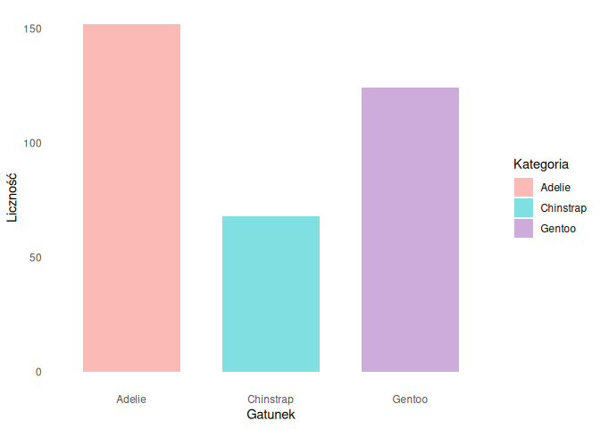

- **Wyspa**

``` r
dane_wyspa <- podsumuj_zmienna(penguins, "island")
kable(dane_wyspa, align = "l")
```

| Kategoria | Liczebność |
|:----------|:-----------|
| Biscoe    | 168        |
| Dream     | 124        |
| Torgersen | 52         |

``` r
rysuj_wykres(dane_wyspa, "Wyspa")
```

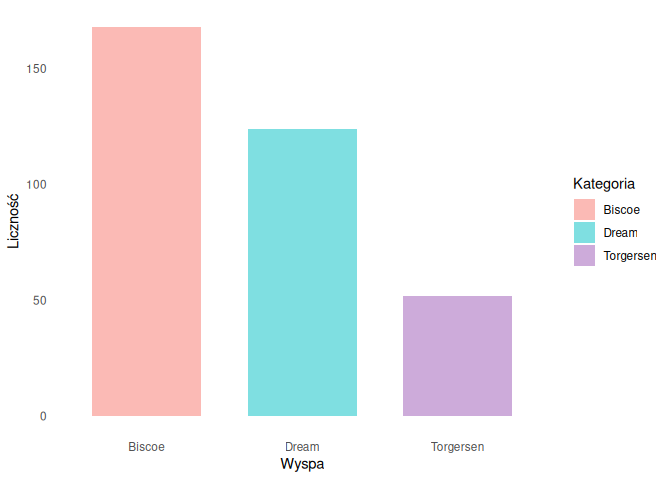

- **Płeć**

``` r
dane_plec <- podsumuj_zmienna(penguins, "sex")
kable(dane_plec, align = "l")
```

| Kategoria | Liczebność |
|:----------|:-----------|
| female    | 165        |
| male      | 168        |
| NA        | 11         |

``` r
rysuj_wykres(dane_plec, "Płeć")
```

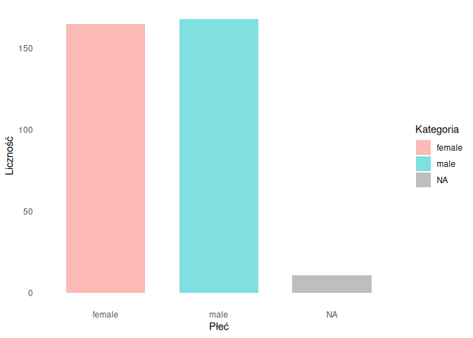

- **Rok**

``` r
dane_rok <- podsumuj_zmienna(penguins, "year")
kable(dane_rok, align = "l")
```

| Kategoria | Liczebność |
|:----------|:-----------|
| 2007      | 110        |
| 2008      | 114        |
| 2009      | 120        |

``` r
rysuj_wykres(dane_rok, "Rok")
```

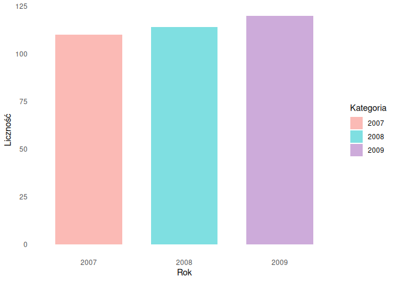

#### Zmienne ilościowe

``` r
data %>%
  select(bill_length_mm, bill_depth_mm, flipper_length_mm, body_mass_g) %>%
  pivot_longer(everything(), names_to = "Zmienna", values_to = "Wartość") %>%
  drop_na(Wartość) %>%
  group_by(Zmienna) %>%
  summarise(
    Min = min(Wartość),
    Max = max(Wartość),
    Mediana = median(Wartość),
    Średnia = round(mean(Wartość), 2),
    `Odch. std.` = round(sd(Wartość), 2)
  ) %>%
kable()
```

| Zmienna           |    Min |    Max | Mediana | Średnia | Odch. std. |
|:------------------|-------:|-------:|--------:|--------:|-----------:|
| bill_depth_mm     |   13.1 |   21.5 |   17.30 |   17.15 |       1.97 |
| bill_length_mm    |   32.1 |   59.6 |   44.45 |   43.92 |       5.46 |
| body_mass_g       | 2700.0 | 6300.0 | 4050.00 | 4201.75 |     801.95 |
| flipper_length_mm |  172.0 |  231.0 |  197.00 |  200.92 |      14.06 |

``` r
data %>%
  select(bill_length_mm, bill_depth_mm, flipper_length_mm, body_mass_g) %>%
  pivot_longer(everything(), names_to = "Zmienna", values_to = "Wartość") %>%
  drop_na(Wartość) %>% 
  ggplot(aes(x = "", y = Wartość, fill = Zmienna)) +
  geom_boxplot(alpha = 0.5, width = 0.2) +
  scale_fill_manual(values = c("#F8766D", "#00BFC4", "#9B59B6", "#F8766D")) +
  theme_minimal() +
  theme(
    legend.position = "none",
    axis.text.x = element_blank() 
  ) +
  labs(
    x = NULL,
    y = "Wartość"
  ) +
  facet_wrap(~ Zmienna, scales = "free_y")
```

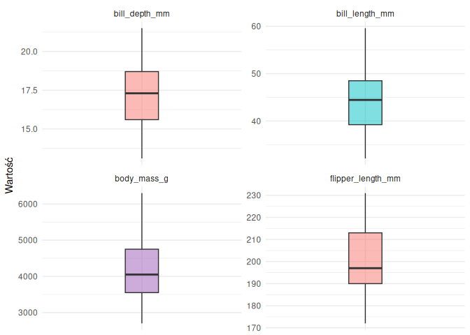<!-- -->

``` r
data %>%
  select(bill_length_mm, bill_depth_mm, flipper_length_mm, body_mass_g) %>%
  pivot_longer(everything(), names_to = "Zmienna", values_to = "Wartość") %>%
  group_by(Zmienna) %>%
  summarise(`Liczba NA` = sum(is.na(Wartość))) %>%
kable(caption = "Liczba brakujących danych w zmiennych ilościowych")
```

| Zmienna           | Liczba NA |
|:------------------|----------:|
| bill_depth_mm     |         2 |
| bill_length_mm    |         2 |
| body_mass_g       |         2 |
| flipper_length_mm |         2 |

Liczba brakujących danych w zmiennych ilościowych

W dalszej analizie brakujące wartości są ignorowane na bieżąco, w
zależności od używanych zmiennych

## Czy wyspa ma znaczenie? - analiza wpływu lokalizacji na rozkład masy ciała

Będziemy chcieli sprawdzić, czy wyspa, na której mieszkają pingwiny ma
istotny wpływ na ich masę ciała. Poniższy wykres przedstawia procentowy
udział poszczególnych gatunków na trzech wyspach Archipelagu Palmera.

``` r
penguins_clean <- data %>% drop_na(species, island)

ggplot(penguins_clean, aes(x = island, fill = species)) +
  geom_bar(position = "fill", alpha = 0.5, width=0.7) +
  scale_y_continuous(labels = scales::percent) +
  scale_fill_manual(values = c("#F8766D", "#00BFC4", "#9B59B6")) +
  theme_minimal() +
  theme(panel.grid.major = element_blank(),
    panel.grid.minor = element_blank()) +
  labs(title = "Struktura gatunkowa na wyspach Archipelagu Palmera",
       x = "Wyspa",
       y = "Procentowy udział gatunków",
       fill = "Gatunek")
```

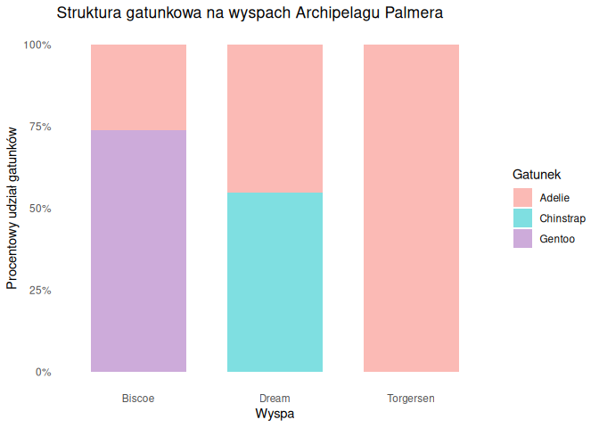<!-- -->

Proporcje na wykresie silnie sugerują, że występowanie konkretnego
gatunku jest ściśle powiązane z geografią. Aby potwierdzić tę hipotezę
matematycznie, przeprowadzimy test niezależności Chi-kwadrat.

### Niezależność pochodzenia pingwinów i gatunku

Przeprowadzamy **test niezależności** $\chi^2$ dla gatunku pingwina i
wyspy z której pochodzi. Uznajemy, że te dwie zmienne nie są niezależne
kiedy $p<0.05$

``` r
tabela_wyspy <- table(penguins_clean$species, penguins_clean$island)
wynik_chi2 <- chisq.test(tabela_wyspy)
```

**p-wartość testu:** 1.3545738^{-63} \< 0.05

Odrzucamy hipotezę zerową, a więc miejsce zamieszkiwania pingwina jest
silnie skorelowane z jego przynależnością gatunkową.

### Analiza wpływu wyspy na masę ciała dla pingwinów Adelie

Dalszą analizę będziemy przeprowadzać tylko dla gatunku Adelie, ponieważ
występuje on jako jedyny na wszystkich trzech wyspach. Wyestymujemy
parametry i przedstawmy je na wykresie.

``` r
penguins_clean_adelie <- penguins_clean %>% drop_na("body_mass_g") %>% filter(species == "Adelie")

statystyki_wyspy <- function(df, group_var, value_var) {
  df %>%
    group_by(across(all_of(group_var))) %>%
    summarise(
      `Liczność` = n(),
      `Estymator (Średnia)` = round(mean(.data[[value_var]]), 2),
      `Dolna granica` = round(t.test(.data[[value_var]])$conf.int[1], 2),
      `Górna granica` = round(t.test(.data[[value_var]])$conf.int[2], 2),
      .groups = 'drop'
    ) %>%
    rename(Wyspa = 1)
}

tabela_wynikow <- statystyki_wyspy(penguins_clean_adelie, "island", "body_mass_g")
kable(tabela_wynikow, caption = "Estymacja masy ciała (g) pingwinów Adelie na wyspach z 95% przedziałami ufności")
```

| Wyspa     | Liczność | Estymator (Średnia) | Dolna granica | Górna granica |
|:----------|---------:|--------------------:|--------------:|--------------:|
| Biscoe    |       44 |             3709.66 |       3561.37 |       3857.94 |
| Dream     |       56 |             3688.39 |       3566.50 |       3810.28 |
| Torgersen |       51 |             3706.37 |       3581.18 |       3831.56 |

Estymacja masy ciała (g) pingwinów Adelie na wyspach z 95% przedziałami
ufności

``` r
ggplot(penguins_clean_adelie, aes(x = island, y = body_mass_g)) +
  geom_violin(fill = "#F8766D", trim = FALSE, alpha = 0.5, width=0.5) +
  geom_errorbar(data = tabela_wynikow, 
                aes(x = Wyspa, ymin = `Dolna granica`, ymax = `Górna granica`), 
                inherit.aes = FALSE, width = 0.1, linewidth = 1) +
  geom_point(data = tabela_wynikow, 
             aes(x = Wyspa, y = `Estymator (Średnia)`), 
             inherit.aes = FALSE, size = 3) +
             
  theme_minimal() +
  labs(title = "Rozkład masy ciała pingwinów Adelie na wyspach",
       subtitle = "Kropka z widełkami to estymator średniej i jego 95% przedział ufności.",
       x = "Wyspa",
       y = "Masa ciała (g)") +
  theme(plot.subtitle = element_text(size = 9))
```

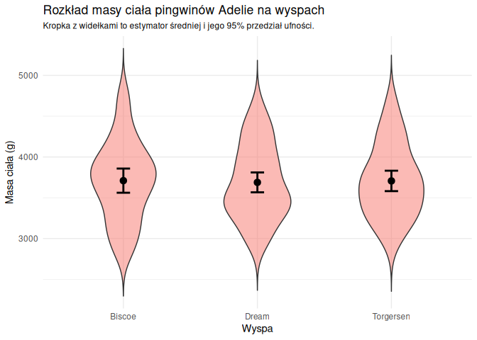<!-- -->

Wyniki przedstawione na powyższym wykresie sugerują brak różnic w masie
ciała pingwinów Adelie pomiędzy wyspami. Żeby potwierdzić te obserwacje
zastosujemy analizę wariancji jednoczynnikowej (ANOVA).

### Analiza ANOVA

Zanim przejdziemy do głównej analizy, musimy upewnić się, że dane mają
rozkład normalny i są homoscedatyczne. Sprawdzamy to za pomocą testu
Shapiro-Wilka oraz testu Bartletta. W obu przypadkach oczekujemy braku
istotności statystycznej ($p > 0,05$).

``` r
#test Shapiro-Wilka
tabela_shapiro <- penguins_clean_adelie %>%
  group_by(island) %>%
  summarise(
    `Statystyka W` = round(shapiro.test(body_mass_g)$statistic, 4),
    `Wartość p` = round(shapiro.test(body_mass_g)$p.value, 4),
    `Czy p > 0,05?` = ifelse(shapiro.test(body_mass_g)$p.value > 0.05, 'Tak', 'Nie')
  ) %>%
  rename(Wyspa = island)

kable(tabela_shapiro, 
      caption = "Wyniki testu normalności Shapiro-Wilka dla masy ciała na poszczególnych wyspach")
```

| Wyspa     | Statystyka W | Wartość p | Czy p \> 0,05? |
|:----------|-------------:|----------:|:---------------|
| Biscoe    |       0.9772 |    0.5258 | Tak            |
| Dream     |       0.9656 |    0.1099 | Tak            |
| Torgersen |       0.9719 |    0.2636 | Tak            |

Wyniki testu normalności Shapiro-Wilka dla masy ciała na poszczególnych
wyspach

``` r
# test Bartletta
wynik_bartlett <- bartlett.test(body_mass_g ~ island, data = penguins_clean_adelie)
```

**Statystyka K2:** 0.4177

**p-wartość testu Barttletta:** 0.8115 \> 0.05

Założenia modelu parametrycznego są spełnione, zatem możemy wykorzystać
analizę wariancji ANOVA.

$H_0$: $\mu_1 = \mu_2 = \mu_3$

$H_1$: Przynajmniej jedna grupa różni się średnią od pozostałych.

``` r
anova_wyspy <- summary(aov(body_mass_g ~ island, data = penguins_clean_adelie))
```

**Statystyka F:** 0.032

**p-wartość:** 0.9685 \> 0.05

P-wartość jest większa niż 0.05, więc nie mamy podstaw, żeby odrzucić
hipotezę zerową. Potwierdza to wnioski wyciągnięte z estymacji.
Podsumowując, masa ciała pingwinów Adelie nie zależy od wyspy, na której
mieszkają.

## Wymiary dzioba a płeć - analiza dymorfizmu płciowego na podstawie cech budowy dzioba

Chcemy sprawdzić, czy wymiary dzioba różnią się pomiędzy płciami
pingwinów. Istnieje jednak możliwość, że nieuwzględnienie gatunku w
analizie zaburzy wyniki.

``` r
penguins_clean <- data %>% drop_na(species, bill_length_mm, bill_depth_mm, sex)
ggplot(penguins_clean, aes(x = species, y = bill_length_mm)) +
  geom_violin(fill = "#F8766D", trim = FALSE, alpha = 0.5, width=0.5) +
  geom_boxplot(fill = "#F8766D", width = 0.1, alpha = 0.7) +
  theme_minimal() +
  labs(title = "Długość dzioba u poszczególnych gatunków",
       x = "Gatunek",
       y = "Długość dzioba (mm)")
```

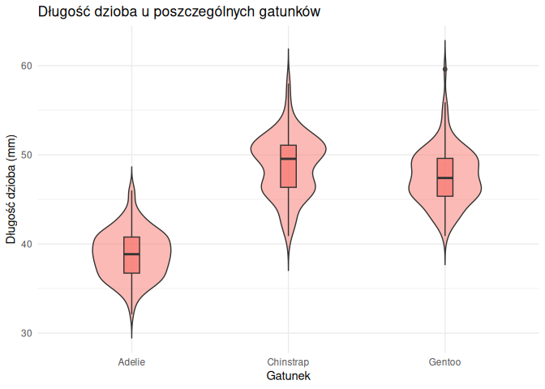<!-- -->

``` r
ggplot(penguins_clean, aes(x = species, y = bill_depth_mm)) +
  geom_violin(fill = "#F8766D", trim = FALSE, alpha = 0.5, width=0.5) +
  geom_boxplot(fill = "#F8766D", width = 0.1, alpha = 0.7) +
  theme_minimal() +
  labs(title = "Grubość dzioba u poszczególnych gatunków",
       x = "Gatunek",
       y = "Grubość dzioba (mm)")
```

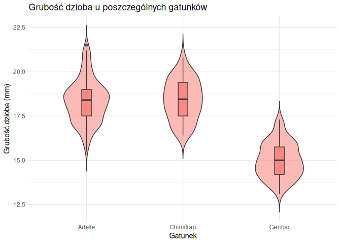<!-- -->

Na wykresach widać, że wymiary dzioba są wyraźnie uzależnione od
gatunku, co może maskować realne różnice między płciami. Z tego powodu w
dalszej analizie będziemy stosować podział na gatunki.

### Analiza dymorfizmu płciowego

Przeanalizujmy wykresy przedstawiające rozkład wymiarów dzioba zależnie
od gatunku i płci:

``` r
penguins_clean <- data %>% drop_na(species, bill_length_mm, bill_depth_mm, sex)
ggplot(penguins_clean, aes(x = sex, y = bill_length_mm, fill = sex)) +
  geom_violin(alpha = 0.5, trim = FALSE) +
  geom_boxplot(width = 0.1, alpha = 0.7) +
  facet_wrap(~ species) +
  theme_minimal() +
  theme(
    legend.position = "none",
    panel.grid.major = element_blank(),
    panel.grid.minor = element_blank(),
    strip.text = element_text(face = "bold", size = 12)
  ) +
  labs(
    title = "Długość dzioba u poszczególnych gatunków",
    x = "Płeć",
    y = "Długość dzioba (mm)"
  )
```

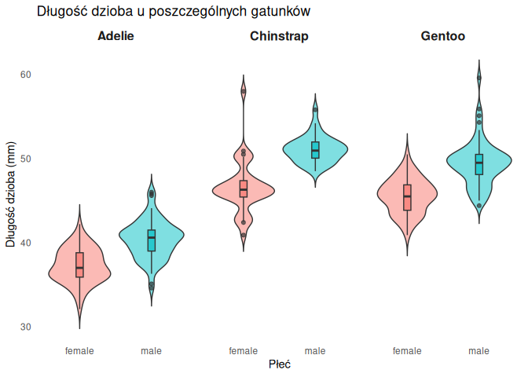<!-- -->

``` r
ggplot(penguins_clean, aes(x = sex, y = bill_depth_mm, fill = sex)) +
  geom_violin(alpha = 0.5, trim = FALSE) +
  geom_boxplot(width = 0.1, alpha = 0.7) +
  facet_wrap(~ species) +
  theme_minimal() +
  theme(
    legend.position = "none",
    panel.grid.major = element_blank(),
    panel.grid.minor = element_blank(),
    strip.text = element_text(face = "bold", size = 12)
  ) +
  labs(
    title = "Grubość dzioba u poszczególnych gatunków",
    x = "Płeć",
    y = "Grubość dzioba (mm)"
  )
```

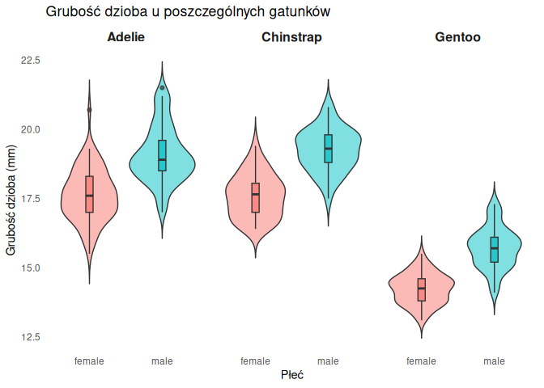<!-- -->

Będziemy się spodziewać, że samice każdego gatunku mają krótsze i
cieńsze dzioby. Żeby potwierdzić tą tezę testami t-studenta, musimy
najpierw potwierdzić normalność danych testami Shapiro-Wilka:

``` r
tabela_shapiro_plec <- penguins_clean %>%
  group_by(species, sex) %>%
  summarise(
    `Długość: wartość p` = round(shapiro.test(bill_length_mm)$p.value, 4),
    `Czy normalny?` = ifelse(`Długość: wartość p` > 0.05, "Tak", "Nie"),
    `Grubość: wartość p` = round(shapiro.test(bill_depth_mm)$p.value, 4),
    `Czy normalny? ` = ifelse(`Grubość: wartość p` > 0.05, "Tak", "Nie"),
    .groups = "drop"
  ) %>% rename(Gatunek = species, Płeć = sex)

kable(tabela_shapiro_plec)
```

| Gatunek | Płeć | Długość: wartość p | Czy normalny? | Grubość: wartość p | Czy normalny? |
|:---|:---|---:|:---|---:|:---|
| Adelie | female | 0.8952 | Tak | 0.4364 | Tak |
| Adelie | male | 0.6067 | Tak | 0.0335 | Nie |
| Chinstrap | female | 0.0017 | Nie | 0.2296 | Tak |
| Chinstrap | male | 0.1768 | Tak | 0.8625 | Tak |
| Gentoo | female | 0.8951 | Tak | 0.7360 | Tak |
| Gentoo | male | 0.0051 | Nie | 0.4010 | Tak |

Niestety, ze względu na brak normalności wszystkich danych, rezygnujemy
z testu t-studenta na rzecz testu Manna-Whitneya.

$H_0: P(X_{samiec} > X_{samica}) \leq 0,5$

$H_1: P(X_{samiec} > X_{samica}) > 0,5$

``` r
tabela_wilcox_jednostronny_dlugosc <- penguins_clean %>%
  group_by(species) %>%
  summarise(
    # alternative = "less", bo "female" jest przed "male"
    `Statystyka W` = wilcox.test(bill_length_mm ~ sex, alternative = "less", exact = FALSE)$statistic,
    `Wartość p` = wilcox.test(bill_length_mm ~ sex, alternative = "less", exact = FALSE)$p.value,
    `Czy p < 0,05?` = ifelse(`Wartość p` < 0.05, "Tak", "Nie")
  )%>% rename(Gatunek = species)

kable(tabela_wilcox_jednostronny_dlugosc, 
      caption = "Jednostronny test Manna-Whitneya - długość dzioba")
```

| Gatunek   | Statystyka W | Wartość p | Czy p \< 0,05? |
|:----------|-------------:|----------:|:---------------|
| Adelie    |        793.0 |         0 | Tak            |
| Chinstrap |         88.5 |         0 | Tak            |
| Gentoo    |        412.5 |         0 | Tak            |

Jednostronny test Manna-Whitneya - długość dzioba

``` r
tabela_wilcox_jednostronny_grubosc <- penguins_clean %>%
  group_by(species) %>%
  summarise(
    # alternative = "less", bo "female" jest przed "male"
    `Statystyka W` = wilcox.test(bill_depth_mm ~ sex, alternative = "less", exact = FALSE)$statistic,
    `Wartość p` = wilcox.test(bill_depth_mm ~ sex, alternative = "less", exact = FALSE)$p.value,
    `Czy p < 0,05?` = ifelse(`Wartość p` < 0.05, "Tak", "Nie")
  )%>% rename(Gatunek = species)

kable(tabela_wilcox_jednostronny_grubosc, 
      caption = "Jednostronny test Manna-Whitneya - grubość dzioba")
```

| Gatunek   | Statystyka W | Wartość p | Czy p \< 0,05? |
|:----------|-------------:|----------:|:---------------|
| Adelie    |        746.5 |         0 | Tak            |
| Chinstrap |         73.5 |         0 | Tak            |
| Gentoo    |        184.0 |         0 | Tak            |

Jednostronny test Manna-Whitneya - grubość dzioba

Przeprowadzony jednostronny test Manna-Whitneya wykazał, że we
wszystkich trzech badanych gatunkach różnice w wymiarach dzioba między
płciami są wysoce istotne statystycznie ($p < 0,001$). Odrzucamy więc
hipotezę zerową. Samce pingwinów charakteryzują się systematycznie i
istotnie większą długością oraz grubością dzioba w porównaniu do samic
swojego gatunku.

## Szukanie rozkładu masy ciała

### Rozkład wagi ogólnie

``` r
penguins_clean <- data %>% drop_na(body_mass_g)
  
stats <- penguins_clean %>%
  summarise(
    mean_val = mean(body_mass_g),
    median_val = median(body_mass_g)
  )
```

**Średnia:** 4201.754386 g

**Mediana:** 4050 g

``` r
ggplot(penguins_clean, aes(x = body_mass_g)) +
  geom_density(alpha = 0.5, fill="#F8766D") +
  theme_minimal() +
  labs(title = "Rozkład masy ciała pingwinów",
       subtitle = "mediana - linia ciągła; średnia - linia przerywana",
       x = "Masa ciała (g)",
       y = "Gęstość")+
  geom_vline(data = stats, aes(xintercept = median_val), 
             linetype = "solid", linewidth = 1.5) +
  geom_vline(data = stats, aes(xintercept = mean_val), 
             linetype = "dashed", linewidth = 1)
```

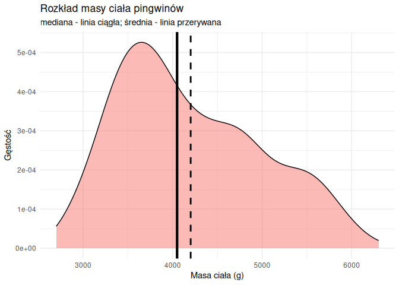<!-- -->

### Rozkład wagi zależnie od gatunku

``` r
penguins_clean <- data %>% drop_na(body_mass_g, species)

stats <- penguins_clean %>%
  group_by(species) %>%
  summarise(
    mean_val = mean(body_mass_g),
    median_val = median(body_mass_g)
  )
```

**Średnia:**

- Adelie: 3700.66 g
- Chinstrap: 3733.09 g
- Gentoo: 5076.02 g

**Mediana:**

- Adelie: 3700 g
- Chinstrap: 3700 g
- Gentoo: 5000 g

``` r
ggplot(penguins_clean, aes(x = body_mass_g, fill = species)) +
  geom_density(alpha = 0.5) +
  theme_minimal() +
  scale_fill_manual(values = c("#F8766D", "#00BFC4", "#9B59B6")) +
  scale_color_manual(values = c("#F8766D", "#00BFC4", "#9B59B6")) +
  labs(title = "Rozkład masy ciała pingwinów według gatunku",
       subtitle = "mediana - linia ciąła; średnia - linia przerywana",
       x = "Masa ciała (g)",
       y = "Gęstość")+
  geom_vline(data = stats, aes(xintercept = median_val, color = species), 
             linetype = "solid", linewidth = 1.5) +
  geom_vline(data = stats, aes(xintercept = mean_val, color = species), 
             linetype = "dashed", linewidth = 1)
```

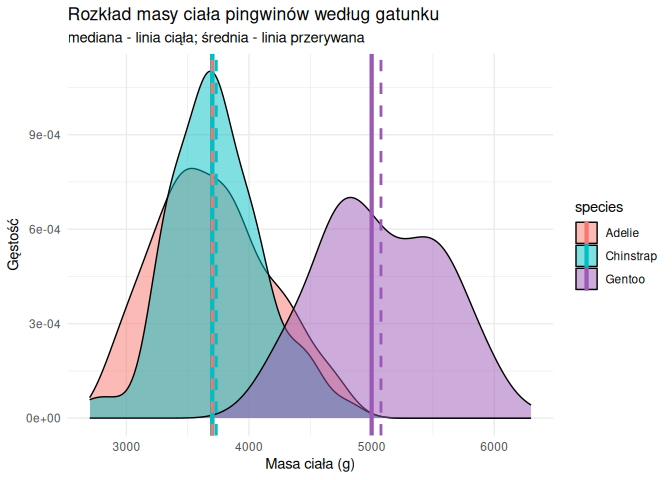<!-- -->

### Rozkład wagi zależnie od płci

``` r
penguins_clean <- data %>% drop_na(body_mass_g, sex)

stats <- penguins_clean %>%
  group_by(sex) %>%
  summarise(
    mean_val = mean(body_mass_g),
    median_val = median(body_mass_g)
  )
```

**Średnia:**

- female: 3862.27 g
- male: 4545.68 g

**Mediana:**

- female: 3650 g
- male: 4300 g

``` r
ggplot(penguins_clean, aes(x = body_mass_g, fill = sex)) +
  geom_density(alpha = 0.5) +
  theme_minimal() +
  labs(title = "Rozkład masy ciała pingwinów według płci",
       subtitle = "mediana - linia ciąła; średnia - linia przerywana",
       x = "Masa ciała (g)",
       y = "Gęstość")+
  geom_vline(data = stats, aes(xintercept = median_val, color = sex), 
             linetype = "solid", linewidth = 1.5) +
  geom_vline(data = stats, aes(xintercept = mean_val, color = sex), 
             linetype = "dashed", linewidth = 1)
```

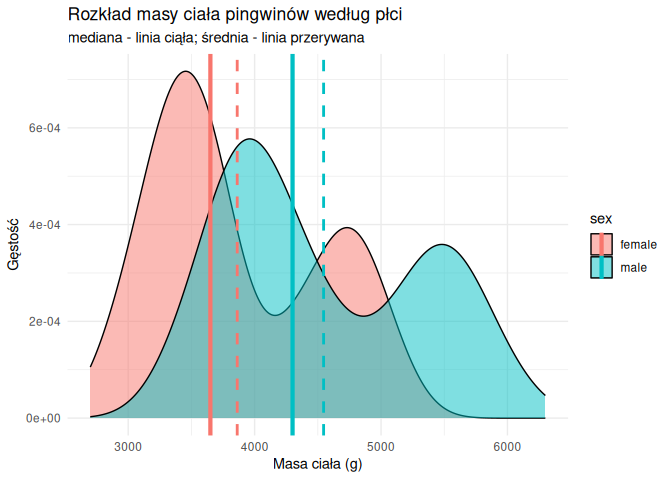<!-- -->

### Rozkład wagi zależnie od płci i gatunku

``` r
penguins_clean <- data %>% drop_na(body_mass_g, species, sex)

stats <- penguins_clean %>%
  group_by(species, sex) %>%
  summarise(
    mean_val = mean(body_mass_g),
    median_val = median(body_mass_g),
    .groups = "drop"
  )
```

| Gatunek   | Płeć   | Średnia (g) | Mediana (g) |
|:----------|:-------|------------:|------------:|
| Adelie    | female |     3368.84 |        3400 |
| Adelie    | male   |     4043.49 |        4000 |
| Chinstrap | female |     3527.21 |        3550 |
| Chinstrap | male   |     3938.97 |        3950 |
| Gentoo    | female |     4679.74 |        4700 |
| Gentoo    | male   |     5484.84 |        5500 |

Porównanie statystyk masy ciała wg gatunków

``` r
ggplot(penguins_clean, aes(x = body_mass_g, fill = sex)) +
  geom_density(alpha = 0.5) +
  facet_wrap(~species) +
  theme_minimal() +
  labs(title = "Rozkład masy ciała z podziałem na gatunek i płeć",
       subtitle = "mediana - linia ciąła; średnia - linia przerywana",
       x = "Masa ciała (g)",
       y = "Gęstość",
       fill = "Płeć") +
  geom_vline(data = stats, aes(xintercept = median_val), 
             linetype = "solid", linewidth = 1.5, color = 'black') +
  geom_vline(data = stats, aes(xintercept = mean_val), 
             linetype = "dashed", linewidth = 1, color = 'magenta')
```

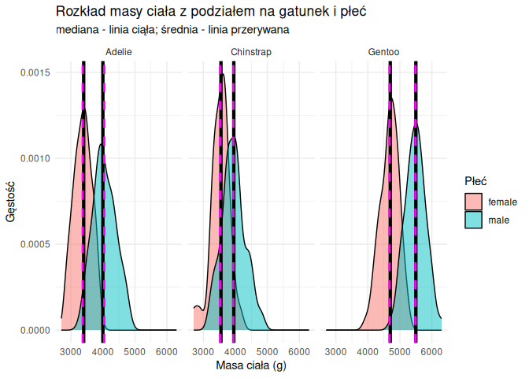<!-- -->

## Czy waga ma rozkład normalny?

Przeprowadzamy **test Shapiro-Wilka** dla każdej pary (gatunek, płeć).
Odrzucamy hipotezę, że rozkład masy ciała w danej grupie jest normalny
kiedy $p < 0.05$

``` r
results_shapiro <- penguins_clean %>%
  group_by(species, sex) %>%
  summarise(
    p_value = shapiro.test(body_mass_g)$p.value,
    czy_mniejsze = ifelse(p_value < 0.05, "Tak", "Nie"),
    .groups = 'drop'
  )
```

| Gatunek   | Płeć   | p-wartość | Czy p \< 0,05? |
|:----------|:-------|----------:|:---------------|
| Adelie    | female | 0.1985303 | Nie            |
| Adelie    | male   | 0.4159824 | Nie            |
| Chinstrap | female | 0.3055292 | Nie            |
| Chinstrap | male   | 0.8910238 | Nie            |
| Gentoo    | female | 0.5106595 | Nie            |
| Gentoo    | male   | 0.9850457 | Nie            |

Wyniki testu Shapiro-Wilka

Hipoteza zerowa nie została odrzucona w żadnej grupie. Na podstawie
wyników testowania możemy założyć, że rozkład wagi dla każdej pary
(gatunek, płeć) jest normalny.

## Skalowanie Pingwina

Czyli **regresja liniowa** masy ciała w zależności od długości skrzydła,
długości dzioba, gatunku i płci

### Konstrukcja modelu liniowego

``` r
data$species <- as.factor(data$species)
data$sex <- as.factor(data$sex)
penguins_clean <- data %>% drop_na(body_mass_g, flipper_length_mm, bill_length_mm, species, sex)
model <- lm(body_mass_g ~ flipper_length_mm + bill_length_mm + species + sex, data = penguins_clean)
# Podsumowanie wyników
summary_model <- summary(model)
sigma2_est <- summary_model$sigma^2  # Estymator sigma^2 (MSE)
r_sq <- summary_model$adj.r.squared
```

Zbudowano model regresji wielorakiej, opisany równaniem:
$$Y_{mass} = \beta_0 + \beta_1 X_{flipper} + \beta_2 X_{bill} + \beta_3 X_{species} + \beta_4 X_{sex} + \epsilon$$

### Wyniki dopasowania

- **Estymator $\sigma^2$ (Błąd średniokwadratowy):** 8.52379^{4}
- **Skorygowany współczynnik $R^2$:** 0.869 (Model wyjaśnia 86.9%
  zmienności).

### Istotność współczynników

Na podstawie wyników funkcji `summary(model)` stwierdzono:

1.  **Długość skrzydła:** Statystycznie istotna ($p < 0.05$),
    współczynnik wynosi 17.85.

2.  **Długość dzioba:** Statystycznie istotna ($p < 0.05$), współczynnik
    wynosi 21.63.

3.  **Gatunek:** Zmienna przekonwertowana na *factor* wykazała istotne
    różnice dla poziomów Gentoo oraz Chinstrap w odniesieniu do Adelie.

4.  **Płeć:** Samce są istotnie cięższe od samic o średnio 465.4 g.

Wszystkie wprowadzone do modelu zmienne objaśniające okazały się
**statystycznie istotne** na poziomie ufności $\alpha = 0.05$.
